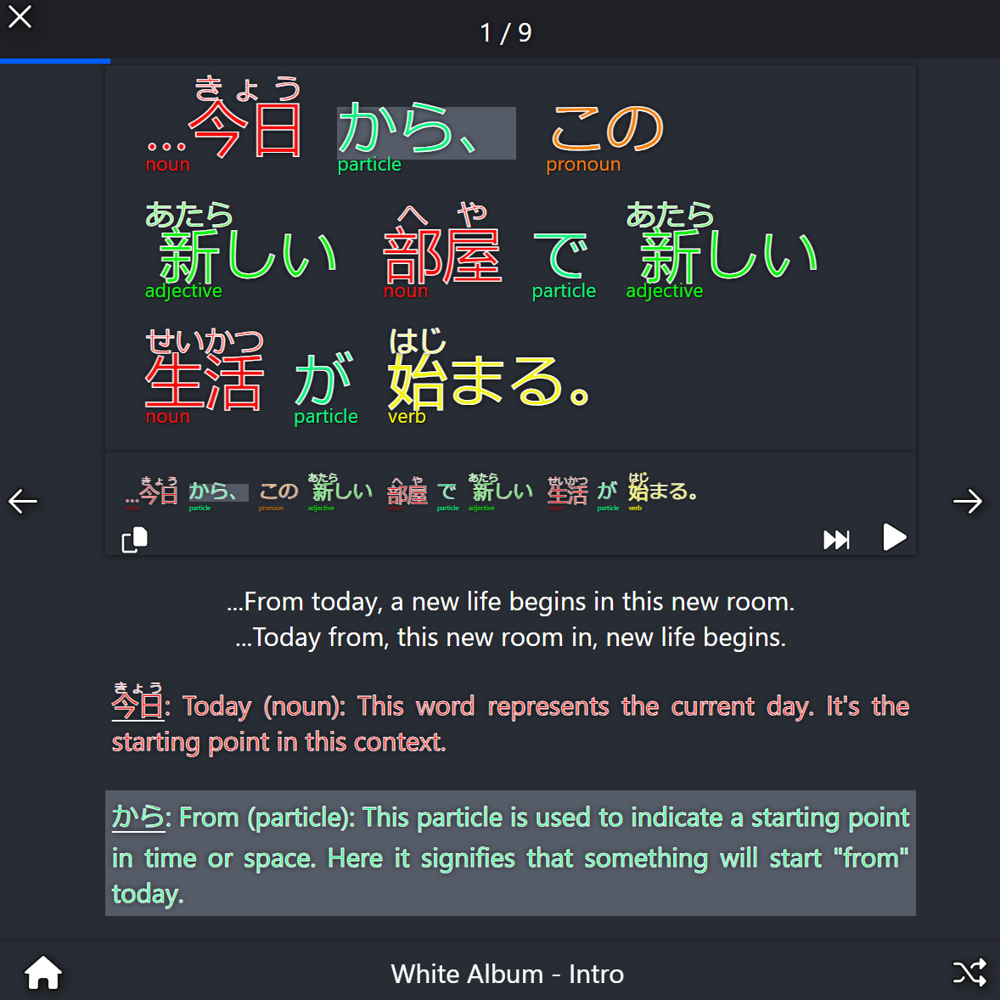

# [Sentsei - Live Web Version](https://vnlike.org/sentsei/)

This is a web application that visualizes Japanese sentence breakdowns for helping beginners learn the language.



## Features
- Normal, slow, and individual word audio playback
- Splitting and highlighting words with breakdowns and supplemental information
- Color coded type labeling (noun, verb, etc.)
- Furigana
- Markdown informational pages for lessons/info
- Multiple lessons
- Spoilery proper and literal translation
- Support for loading in local lessons
- Layout optimized for both desktop and mobile

## What is this?
There are a hundred and one resources for learning Japanese. For me, the best way to learn has been to see sentence breakdowns.

And while you can certainly find a plethora of side-by-side sentence and word translations, a lot of material will break down new concepts and assume the reader is familiar with other things. Or maybe they don't have audio playback of the sentence or its words. Or maybe the breakdown just isn't clear enough.

This project doesn't solve that - it's merely a set of tools to enable a rich interface that enables all of the above when they're available. There are some lessons and breakdowns generated by ChatGPT-4 though, and it does a pretty good job for simple stuff. So if you want to create a lesson or import your own sentences, see [the lesson tutorial](LessonTutorial.MD).

The other thing of note is all of the data is forced to be contextual. For better or for worse, slides can't borrow word definitions, translations, word labels, or audio readings. This means more work goes into a lesson but it can largely be automated.

## Quickstart
This is a ReactJS app, so you'll need [node.js](https://nodejs.org/) and [npm](https://www.npmjs.com/) installed. Then just run this:

```
git clone https://github.com/JuicyStandoffishMan/Sentsei.git
cd Sentsei
npm install
npm run
```

## Creating your own lessons
### [Lesson Tutorial](LessonTutorial.MD)

### Loading lessons locally
On the homepage, just click "Upload Local Lesson" at the top and open &lt;lesson&gt;.zip. Make sure it contains lesson.json and optionally an Audio folder with the selected works. There's more info in the tutorial.

**Note:** The file is just extracted and read locally; nothing is sent remotely. That also means when you refresh the page, you have to re-select it, unfortunately.

### Contributing lessons
If you want to contribute one that you've made, please open a pull request.

## A quick warning on using the existing lessons
The available lessons were generated by ChatGPT-4. I've gone through and fixed some mistakes as I was processing them, but there are likely still things that aren't perfectly accurate. But then again, human instructors are the same, so /shrug. Just keep that in mind if you decide to use them.
